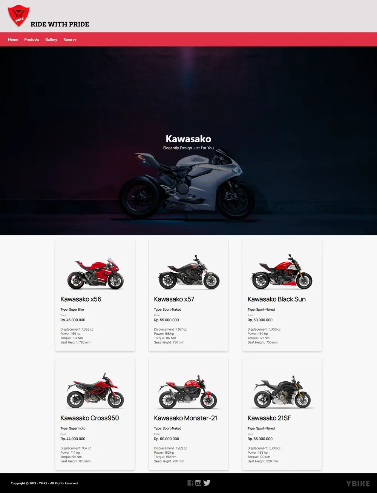
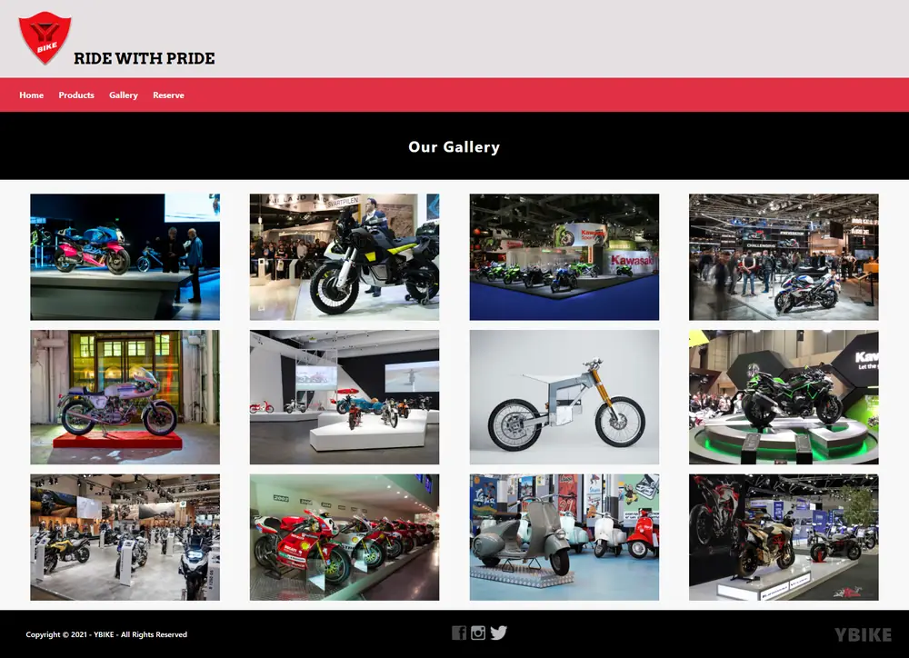
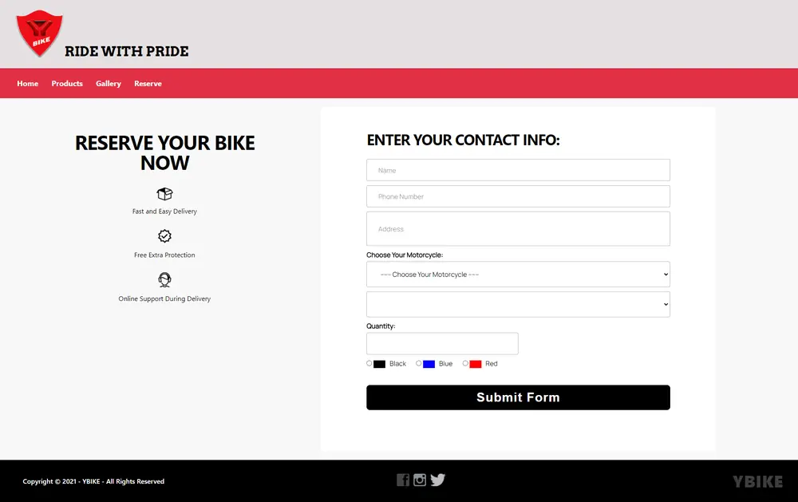

<div align="center">


# HTZL Motorcycle Club

**Situs dealer sepeda motor statis — dibangun dengan Ruby, tersedia dalam lima bahasa.**

Katalog 231 item dengan harga transparan, pencarian instan, koleksi Harley-Davidson
1903–2017, dan formulir reservasi yang benar-benar mengirim pesanan.
Tanpa framework, tanpa basis data, tanpa server.

[](https://github.com/xyb3rpunq/htzl-motorcycle-club/actions/workflows/deploy.yml)
[](https://www.ruby-lang.org)
[](https://jekyllrb.com)
[](test)
[](#lima-bahasa-lima-url)
[](LICENSE)

### [→ Buka situsnya](https://xyb3rpunq.github.io/htzl-motorcycle-club/)

**[🇮🇩 Indonesia](https://xyb3rpunq.github.io/htzl-motorcycle-club/)** ·
[🇬🇧 English](https://xyb3rpunq.github.io/htzl-motorcycle-club/en/) ·
[🇨🇳 简体中文](https://xyb3rpunq.github.io/htzl-motorcycle-club/zh/) ·
[🇷🇺 Русский](https://xyb3rpunq.github.io/htzl-motorcycle-club/ru/) ·
[🇯🇵 日本語](https://xyb3rpunq.github.io/htzl-motorcycle-club/ja/)

<br>


</div>

---

## Daftar isi

- [Fitur](#fitur)
  - [Katalog 231 item](#katalog-231-item)
  - [Koleksi Heritage: 100 Harley-Davidson](#koleksi-heritage-100-harley-davidson)
  - [Dialog detail produk](#dialog-detail-produk)
  - [Galeri dan reservasi](#galeri-dan-reservasi)
  - [Lima bahasa, lima URL](#lima-bahasa-lima-url)
  - [Tampilan ponsel](#tampilan-ponsel)
- [Dari tugas kuliah 2021 ke produk 2026](#dari-tugas-kuliah-2021-ke-produk-2026)
- [Arsitektur](#arsitektur)
- [Katalog dibangun dari Ruby](#katalog-dibangun-dari-ruby)
- [Terjemahan: dua lapis](#terjemahan-dua-lapis)
- [Foto dan lisensi](#foto-dan-lisensi)
- [Performa](#performa)
- [Aksesibilitas](#aksesibilitas)
- [Menjalankan di komputer sendiri](#menjalankan-di-komputer-sendiri)
- [Perintah rake](#perintah-rake)
- [Pengujian](#pengujian)
- [Penerbitan](#penerbitan)
- [Struktur proyek](#struktur-proyek)
- [Lisensi](#lisensi)

> Seluruh tangkapan layar di bawah diambil dari situs yang benar-benar berjalan
> memakai Chrome headless, bukan mockup.

---

## Fitur

### Katalog 231 item

Semua kartu dirender saat build, jadi katalog tetap terbaca tanpa JavaScript dan
terindeks mesin pencari. Penyaringan hanya menyembunyikan elemen di DOM: nol
permintaan jaringan, nol jeda.


Pencarian menerima banyak kata sekaligus, dan seluruh keadaan saringan tersimpan
di URL sehingga tautannya bisa dibagikan. Tampilan bisa diubah menjadi daftar.


| Kontrol | Perilaku |
|---|---|
| Pencarian | Multi-kata, seketika, cocok pada nama, merek, jenis, dan kode |
| Kategori | Tujuh chip dengan penghitung isi masing-masing |
| Merek | Kawasaki, Vixian, Harley-Davidson, dan lini HTZL |
| Rentang harga | Enam tingkat, dari di bawah Rp 500 rb sampai di atas Rp 500 jt |
| Urutan | Relevansi, harga naik, harga turun, nama, rating |
| Tampilan | Kisi atau daftar |
| URL | `?q=helm&category=apparel&sort=price_asc&view=list` |

### Koleksi Heritage: 100 Harley-Davidson

Seratus unit diurutkan dari yang tertua: Model 1 Serial Number One 1903 sampai
Road King Milwaukee-Eight 2017. Model, tahun, dan generasi mesin mengikuti
sejarah produk yang sebenarnya, dikelompokkan ke sebelas generasi mesin dari Era
Perintis sampai Era Milwaukee-Eight.


Enam puluh sembilan unit memakai **foto asli berlisensi bebas** dari Wikimedia
Commons, lengkap dengan atribusi. Sisanya memakai artwork SVG yang dibuat
program.

### Dialog detail produk

Bar bawah menempel sehingga tombol pesan selalu terjangkau, betapa pun panjang
tabel spesifikasinya.


- **Pengatur jumlah** dengan total harga yang berubah seketika
- **Panah kiri dan kanan** berpindah antarproduk tanpa menutup dialog, dengan penunjuk posisi `132 dari 231`
- **Salin tautan** menghasilkan alamat seperti `?item=HTZ-HER-132` yang langsung membuka produk itu bagi penerimanya
- **Pesan WhatsApp** memuat nama, kode, jumlah, total, dan tautan produk
- **Atribusi foto** ditampilkan di dalam dialog, sesuai syarat lisensi Creative Commons
- Tombol Esc menutup, fokus kembali ke tombol asalnya


### Galeri dan reservasi

Galeri memakai elemen `<dialog>` bawaan browser, sehingga jebakan fokus dan
tombol Esc ditangani peramban sendiri. Panah kiri dan kanan berpindah gambar.


Formulir reservasi memvalidasi secara sebaris, menghitung total pesanan langsung,
lalu menyusun pesan WhatsApp yang siap kirim. Tidak ada `alert()`, dan tidak ada
data yang hilang.


### Lima bahasa, lima URL

Setiap bahasa punya alamatnya sendiri, bukan diganti lewat JavaScript. Ini
penting agar mesin pencari mengindeks tiap bahasa sebagai halaman terpisah.

| Bahasa | Kode | Alamat |
|---|---|---|
| Bahasa Indonesia | `id` | `/` |
| English | `en` | `/en/` |
| 简体中文 | `zh-Hans` | `/zh/` |
| Русский | `ru` | `/ru/` |
| 日本語 | `ja` | `/ja/` |


Satu generator Ruby mengalikan enam cetak biru halaman dengan lima bahasa menjadi
tiga puluh halaman, lengkap dengan `hreflang` timbal balik dan `x-default`.

### Tampilan ponsel

Diuji pada lebar 390 piksel. Menu berupa drawer, dialog naik sebagai lembar dari
bawah dengan jarak aman untuk area gestur, dan halaman tidak pernah bisa digeser
mendatar.

<table>
<tr>
<td width="25%"></td>
<td width="25%"></td>
<td width="25%"></td>
<td width="25%"></td>
</tr>
</table>

---

## Dari tugas kuliah 2021 ke produk 2026

Proyek ini berawal dari tugas mata kuliah pemrograman web tahun 2021: lima berkas
HTML statis, jQuery untuk satu slider, dan gambar mentah yang belum dikompres
sama sekali. Versi 2026 menulis ulang seluruhnya di atas Ruby dan Jekyll.

| | Versi 2021 | Versi 2026 |
|---|---|---|
| **Halaman** | 5 berkas HTML ditulis tangan | 31 halaman dibuat generator Ruby |
| **Bahasa** | 1 (Indonesia) | 5 (ID, EN, ZH, RU, JA) dengan `hreflang` |
| **Produk** | 12 motor, ditulis manual di HTML | 231 item dari sumber tunggal Ruby |
| **Gambar produk** | 12 | 231, semuanya punya gambar |
| **Aset gambar** | 19,6 MB mentah | 6,7 MB, seluruhnya WebP dan SVG |
| **JavaScript** | jQuery 89 KB, blocking di `<head>` | 15 KB vanilla, `defer` |
| **Saat layar diputar** | `location.reload()` — muat ulang penuh | tidak terjadi apa-apa |
| **Menu di layar sentuh** | mati (hanya `:hover`) | drawer dan dropdown yang bisa diklik |
| **Formulir pesanan** | `alert()`, data hilang | ringkasan harga dan kirim ke WhatsApp |
| **Gambar** | tanpa `alt`, `width`, `height`, `lazy` | lengkap semua, nol pergeseran tata letak |
| **Tema gelap** | tidak ada | ada, mengikuti sistem, bisa diganti |
| **SEO** | tanpa `description`, OG, sitemap | lengkap dengan JSON-LD `AutoDealer` |
| **Lisensi aset** | tidak dicatat | 69 foto beratribusi, semuanya lisensi bebas |
| **Pengujian** | tidak ada | 117 test, 21.081 assertion |

<details>
<summary><b>Tampilan versi 2021 (klik untuk lihat)</b></summary>

<br>

| Katalog produk | Galeri | Reservasi |
|---|---|---|
|  |  |  |

</details>

---

## Arsitektur

GitHub Pages hanya menyajikan berkas statis — Rails tidak bisa berjalan di sana
karena butuh proses server yang hidup. Jekyll adalah generator situs statis
berbasis Ruby yang didukung GitHub Pages secara asli, jadi proyek ini tetap
ditulis dalam Ruby sambil menghasilkan HTML yang termuat seketika.

Struktur proyeknya sengaja mengikuti konvensi Rails:

| Rails | Proyek ini | Isi |
|---|---|---|
| `db/seeds.rb` | `lib/seed_catalog.rb` | Menulis katalog ke `_data/` |
| `app/models/` | `lib/htzl/catalog.rb`, `lib/htzl/heritage.rb` | Sumber tunggal data produk |
| `app/helpers/` | `lib/htzl/filters.rb` | Rupiah, slug, tautan WhatsApp, pelokalan angka |
| `config/locales/` | `_data/i18n/*.yml` | String antarmuka dan kamus istilah |
| `app/views/layouts/` | `_layouts/` | Kerangka halaman |
| `app/views/shared/` | `_includes/` | Komponen yang dipakai berulang |
| `config/routes.rb` | `lib/htzl/locales.rb` | Cetak biru URL per bahasa |
| `lib/tasks/` | `Rakefile` | seed, art, photos, build, test |
| `test/` | `test/` | Minitest |

Aturan yang dipegang: **seluruh logika ada di `lib/`, dan `_plugins/` hanya
adapter tipis ke Jekyll.** Dengan begitu setiap fungsi bisa diuji Minitest tanpa
menjalankan Jekyll sama sekali.

```
lib/htzl/catalog.rb   ──rake seed──>  _data/catalog.yml   ──┐
lib/htzl/heritage.rb                  (231 item)            │
                                                            ├─jekyll build─> _site/
lib/generate_art.rb   ──rake art───>  assets/img/products/  │   (31 halaman)
lib/fetch_*.py        ──rake photos─> assets/img/heritage/  ─┘
```

---

## Katalog dibangun dari Ruby

Produk tidak ditulis satu per satu di HTML. Semuanya dibangun program dengan seed
acak tetap (`20161230`, tanggal berdiri HTZL), jadi hasilnya selalu sama di
setiap build — CI bahkan memverifikasi ini lewat `git diff --exit-code`.

| Kategori | Jumlah | Rentang harga |
|---|--:|---|
| Koleksi Heritage (Harley-Davidson 1903–2017) | 100 | Rp 150 jt – 4,5 M |
| Motor (12 model × 3 trim) | 36 | Rp 40 jt – 98,5 jt |
| Sparepart & performa | 30 | Rp 145 rb – 14,2 jt |
| Apparel & gear | 26 | Rp 165 rb – 11,5 jt |
| Aksesori & touring | 15 | Rp 295 rb – 7,8 jt |
| Oli & perawatan | 14 | Rp 75 rb – 1,05 jt |
| Layanan bengkel | 10 | Rp 185 rb – 2,45 jt |
| **Total** | **231** | **Rp 75.000 – Rp 4.500.000.000** |

Menambah produk cukup dengan menyunting satu larik di `lib/htzl/catalog.rb` lalu
menjalankan `rake seed` — kartu, saringan, penghitung kategori, sitemap, dan JSON
API ikut menyesuaikan sendiri.

---

## Terjemahan: dua lapis

Menerjemahkan katalog bukan sekadar soal kata. Bahasa Indonesia memakai titik
sebagai pemisah ribuan, sehingga `1.362 cc` terbaca **1,362** (satu koma tiga)
oleh pembaca berbahasa Inggris. Karena itu penanganannya dua lapis.

**Lapis 1 — algoritmik (`HTZL::Measures`).** Nilai berpola angka dan satuan
dilokalkan otomatis, sehingga produk baru tidak perlu entri kamus sama sekali.

| Sumber (ID) | EN / ZH / JA | RU |
|---|---|---|
| `1.362 cc` | `1,362 cc` | `1362 cc` |
| `0,8 mm` | `0.8 mm` | `0,8 mm` |
| `12 bulan` | `12 months` / `12 个月` | `12 мес.` |
| `120 mata` | `120 links` | `120 звеньев` |
| `ECE 22.06` | tidak diubah | tidak diubah |
| `Knucklehead` | tidak diubah | tidak diubah |

Kode standar dan nama diri sengaja dibiarkan apa adanya. Frasa yang memuat kata
Indonesia diserahkan ke lapis berikutnya, bukan diterjemahkan sebagian.

**Lapis 2 — kamus (`_data/i18n/*.yml`).** Seluruh istilah dan frasa yang tersisa
diterjemahkan penuh ke empat bahasa.

| Yang diterjemahkan | Jumlah | Cakupan |
|---|--:|---|
| Kategori | 7 | 100% |
| Subkategori | 39 | 100% |
| Nama spesifikasi | 108 | 100% |
| Nilai spesifikasi | 629 | 100% (340 otomatis, 289 kamus) |
| Antarmuka dan naskah halaman | seluruhnya | 100% |

```bash
bundle exec rake i18n:report
```

---

## Foto dan lisensi

Menempelkan watermark pada foto orang lain **tidak** menghapus hak cipta. Justru
berisiko dianggap mengklaim karya tersebut, dan menutupi informasi kepemilikan
merupakan pelanggaran tersendiri. Karena itu pendekatan yang dipakai berbeda:
hanya mengambil berkas yang lisensinya memang mengizinkan penggunaan ulang.

`rake photos` menanyai Wikimedia Commons dan **hanya menerima** domain publik,
CC0, CC BY, dan CC BY-SA. Berkas non-komersial atau tanpa turunan ditolak
otomatis.

| Lisensi | Jumlah foto |
|---|--:|
| CC BY-SA 4.0 | 48 |
| CC BY 2.0 | 7 |
| Domain publik | 5 |
| CC BY-SA 3.0 | 5 |
| CC BY-SA 2.0 | 3 |
| CC BY 4.0 | 1 |
| **Total** | **69** |

Nama pembuat, jenis lisensi, dan tautan sumber dicatat di
`_data/photo_credits.yml`, lalu ditampilkan di dua tempat: halaman detail tiap
produk, dan daftar lengkap di [NOTICE.md](NOTICE.md).

126 item sisanya memakai **artwork SVG yang dibuat program** oleh
`rake art`: gradien khas kategori, ikon besar yang diambil ulang dari sprite,
lalu nama dan kode produk. Rata-rata 1,1 KB per berkas, bersih secara lisensi.

---

## Performa

Diukur pada halaman katalog — halaman terberat, berisi 231 kartu produk sekaligus.

| Metrik | Nilai |
|---|---|
| HTML katalog setelah gzip | **47 KB** (719 KB mentah) |
| HTML beranda setelah gzip | **11 KB** |
| DOMContentLoaded | **175 ms** |
| Muat penuh | **191 ms** |
| Permintaan JavaScript | 2 berkas, 15 KB, keduanya `defer` |
| Permintaan pihak ketiga | **0** |

Yang membuatnya ringan:

- Seluruh kartu dirender saat build, jadi tetap terbaca tanpa JavaScript
- Penyaringan hanya menyembunyikan elemen di DOM — nol permintaan jaringan
- `content-visibility: auto` membuat browser melewati kartu yang belum terlihat
- Semua gambar WebP atau SVG, punya `width`/`height`, dan `loading="lazy"` kecuali yang pertama
- 126 item memakai artwork SVG rata-rata 1,1 KB
- Font Arvo di-host sendiri: nol permintaan ke Google Fonts

---

## Aksesibilitas

- Navigasi keyboard penuh, dengan indikator fokus yang jelas di semua kontrol
- Tautan lewati-ke-konten
- Dialog memakai elemen `<dialog>` bawaan, sehingga jebakan fokus dan tombol Esc ditangani browser
- Semua gambar punya `alt` yang bermakna
- Target sentuh minimal 44 piksel
- `aria-current`, `aria-expanded`, `aria-pressed`, `aria-live`, dan `role="alert"` pada galat formulir
- Menghormati `prefers-reduced-motion`: putar otomatis dan animasi dimatikan
- Kontras warna terjaga di tema terang maupun gelap

---

## Menjalankan di komputer sendiri

Prasyarat: Ruby 3.1 atau lebih baru.

```bash
git clone https://github.com/xyb3rpunq/htzl-motorcycle-club.git
cd htzl-motorcycle-club
bundle install
bundle exec rake serve
```

Situs akan tersedia di <http://localhost:4000/htzl-motorcycle-club/>.

---

## Perintah rake

```bash
bundle exec rake seed         # bangun ulang katalog dari lib/htzl/catalog.rb
bundle exec rake art          # buat artwork SVG untuk produk tanpa foto
bundle exec rake photos       # ambil foto berlisensi bebas dari Wikimedia Commons
bundle exec rake build        # seed lalu build ke _site
bundle exec rake serve        # server pengembangan dengan livereload
bundle exec rake test         # jalankan seluruh test
bundle exec rake ci           # seed, build, lalu test (dipakai GitHub Actions)
bundle exec rake i18n:report  # laporan cakupan terjemahan
```

`rake photos` adalah tugas khusus pengembang dan membutuhkan Python dengan
Pillow. Hasilnya ikut disimpan di repositori, sehingga CI tidak pernah perlu
mengakses jaringan.

---

## Pengujian

117 test, 21.081 assertion, berjalan dalam kurang dari satu detik.

| Berkas | Cakupan |
|---|---|
| `test/catalog_test.rb` | Tiap fungsi publik `HTZL::Catalog`, keunikan SKU dan slug, kewajaran harga, konsistensi trim, keberadaan berkas gambar |
| `test/heritage_test.rb` | Koleksi berisi tepat 100 unit dengan nama unik dan urut dari yang tertua, tiap generasi mesin terpetakan, **setiap foto memakai lisensi bebas dan membawa atribusi lengkap** |
| `test/filters_test.rb` | Tiap filter Liquid, pelokalan angka per bahasa, penyandian URL huruf Kiril, penanganan nilai `nil` |
| `test/i18n_test.rb` | Struktur kunci identik di lima bahasa, tidak ada nilai kosong, kamus menutupi seluruh data katalog tanpa entri usang |
| `test/build_test.rb` | Hasil build: tautan aset tidak putus, `hreflang` lengkap, tidak ada sisa sintaks Liquid, anggaran ukuran halaman |
| `test/css_test.rb` | Penjaga regresi untuk bug tata letak yang pernah terjadi |

`css_test.rb` menjaga tiga bug nyata yang ditemukan saat pengujian di peramban
dan sudah diperbaiki:

1. **`backdrop-filter` pada `.site-header`.** Properti ini membuat containing
   block baru untuk keturunan `position: fixed`, sehingga drawer mobile ikut
   terpotong setinggi header — menunya jadi kotak 60 piksel berisi padding saja.
   Efek blur dipindahkan ke pseudo-element.
2. **Panel dropdown bahasa meluber ke luar viewport** di layar 1366 piksel dan
   membuat halaman bisa digeser mendatar. Dropdown di dekat tepi kanan sekarang
   dibuka ke arah dalam.
3. **Reset global `* { margin: 0 }` menimpa `margin: auto` bawaan `<dialog>`,**
   sehingga dialog detail produk menempel ke tepi kiri layar alih-alih berada di
   tengah.

---

## Penerbitan

Setiap dorongan ke `main` memicu [GitHub Actions](.github/workflows/deploy.yml):

1. Pasang Ruby 3.3 dan gem yang dibutuhkan
2. `rake seed`, lalu pastikan katalog hasil generator tidak berubah (`git diff --exit-code`)
3. `jekyll build`
4. Jalankan seluruh test — **penerbitan dibatalkan bila ada yang gagal**
5. Terbitkan `_site` ke GitHub Pages

Pull request hanya diuji, tidak diterbitkan.

---

## Struktur proyek

```
htzl-motorcycle-club/
├── lib/htzl/
│   ├── catalog.rb          # sumber tunggal 231 produk
│   ├── heritage.rb         # 100 Harley-Davidson, 1903 sampai 2017
│   ├── filters.rb          # helper pemformatan, penerjemah, pelokal angka
│   └── locales.rb          # daftar bahasa dan cetak biru URL
├── lib/seed_catalog.rb     # padanan db/seeds.rb
├── lib/generate_art.rb     # artwork SVG untuk produk tanpa foto
├── lib/fetch_heritage_photos.py  # pengambil foto berlisensi bebas
├── _plugins/
│   ├── i18n.rb             # generator 30 halaman berbahasa
│   ├── htzl_filters.rb     # pendaftaran filter ke Liquid
│   └── catalog_api.rb      # penerbit /assets/catalog.json
├── _data/
│   ├── catalog.yml         # dibuat otomatis, jangan disunting
│   ├── photo_credits.yml   # atribusi 69 foto Wikimedia
│   └── i18n/               # id, en, zh, ru, ja, terms, spec_values
├── _layouts/               # home, catalog, brand, gallery, reserve, 404
├── _includes/              # head, header, footer, kartu produk, dialog, sprite ikon
├── assets/
│   ├── css/site.css        # 1.310 baris, tanpa framework
│   ├── js/                 # site, catalog, reserve — 881 baris vanilla
│   ├── fonts/              # Arvo, di-host sendiri
│   └── img/                # WebP dan SVG
├── test/                   # 117 test Minitest
└── .github/workflows/      # CI dan penerbitan
```

Total kode Ruby: 2.259 baris di 16 berkas.

---

## Lisensi

Kode berlisensi [MIT](LICENSE). Font Arvo berlisensi SIL Open Font License 1.1.
Foto koleksi heritage berlisensi domain publik atau Creative Commons dengan
atribusi. Rincian lengkapnya ada di [NOTICE.md](NOTICE.md).

> **HTZL Motorcycle Club adalah perusahaan fiktif.** Situs ini karya portofolio
> untuk keperluan belajar. Tidak ada afiliasi dengan produsen sepeda motor mana
> pun. Seluruh harga, spesifikasi, stok, dan berita adalah data contoh yang
> dibuat oleh program.

<div align="center">
<br>
Dibuat oleh <a href="https://github.com/xyb3rpunq">Daniel Hutajulu</a>
<br><br>
<a href="https://www.instagram.com/danielxyz_/">Instagram</a> ·
<a href="https://x.com/xyb3rpunk">X</a> ·
<a href="https://www.linkedin.com/in/daniel-hutajulu23/">LinkedIn</a>
</div>
