<div align="center">

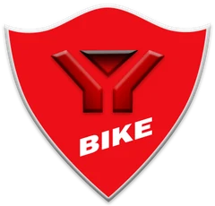

# HTZL Motorcycle Club

### Dealer sepeda motor dengan katalog yang benar-benar bisa dipakai memilih.

231 produk berharga transparan, koleksi Harley-Davidson 1903–2017,
dan pemesanan yang sampai ke WhatsApp dalam satu ketukan.
Lima bahasa, terang dan gelap, ringan di ponsel.

[](https://github.com/xyb3rpunq/htzl-motorcycle-club/actions/workflows/deploy.yml)
[](#lima-bahasa-satu-pengalaman)
[](#kualitas-yang-bisa-diukur)
[](https://www.ruby-lang.org)
[](LICENSE)

### [→ Buka situsnya](https://xyb3rpunq.github.io/htzl-motorcycle-club/)

**[🇮🇩 Indonesia](https://xyb3rpunq.github.io/htzl-motorcycle-club/)** ·
[🇬🇧 English](https://xyb3rpunq.github.io/htzl-motorcycle-club/en/) ·
[🇨🇳 简体中文](https://xyb3rpunq.github.io/htzl-motorcycle-club/zh/) ·
[🇷🇺 Русский](https://xyb3rpunq.github.io/htzl-motorcycle-club/ru/) ·
[🇯🇵 日本語](https://xyb3rpunq.github.io/htzl-motorcycle-club/ja/)

<br>

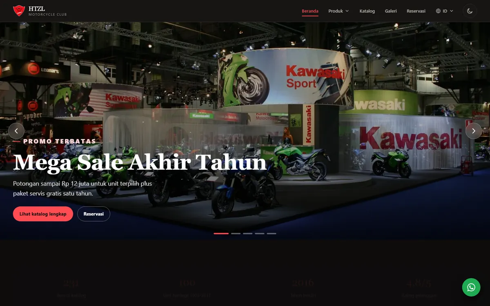

</div>

---

## Daftar isi

- [Identitas visual](#identitas-visual)
- [Sistem desain](#sistem-desain)
- [Fitur](#fitur)
  - [Katalog: 231 produk, satu layar](#katalog-231-produk-satu-layar)
  - [Koleksi Heritage: 100 Harley-Davidson](#koleksi-heritage-100-harley-davidson)
  - [Detail produk dan pemesanan](#detail-produk-dan-pemesanan)
  - [Galeri](#galeri)
  - [Reservasi](#reservasi)
  - [Lima bahasa, satu pengalaman](#lima-bahasa-satu-pengalaman)
  - [Di ponsel](#di-ponsel)
- [Kualitas yang bisa diukur](#kualitas-yang-bisa-diukur)
- [Di balik layar](#di-balik-layar)
- [Menjalankan sendiri](#menjalankan-sendiri)
- [Lisensi](#lisensi)

> Semua tangkapan layar diambil dari situs yang berjalan, bukan mockup.

---

## Identitas visual

HTZL memposisikan diri sebagai dealer yang serius soal mesin, bukan toko
serba-ada. Tampilannya karena itu sengaja gelap, padat, dan tegas — lebih dekat
ke rasa ruang pamer daripada etalase belanja.

**Logo.** Perisai merah dengan huruf Y dan kata BIKE. Bentuk perisai dipilih
karena koleksinya banyak berisi motor tua bernilai tinggi; kesan yang dituju
adalah menjaga, bukan menjual cepat.

**Warna.** Satu merah sebagai aksen tunggal, sisanya netral hangat. Merah hanya
muncul pada harga, tautan aktif, dan tombol utama, sehingga mata pengunjung
selalu tahu ke mana harus melihat.

| Peran | Terang | Gelap |
|---|---|---|
| Aksen merek | `#d81f26` | `#ff4b52` |
| Latar halaman | `#f6f5f4` | `#0e0d0c` |
| Kartu | `#ffffff` | `#191716` |
| Teks utama | `#1a1715` | `#f5f2ef` |
| Teks sekunder | `#5c5551` | `#b9b1ab` |
| Garis | `#e2ddd8` | `#2d2a27` |
| Tersedia | `#14724a` | `#4ad991` |
| Stok menipis | `#9a6400` | `#e8b45c` |

Setiap pasangan warna di tabel itu dihitung rasio kontrasnya dan lolos ambang
WCAG AA di kedua tema — bukan sekadar dipilih karena enak dilihat.

**Tipografi.** Dua jenis huruf dengan tugas berbeda:

- **Arvo**, slab serif, untuk judul, nama produk, dan harga. Bentuknya tebal
  dan bersudut, sejalan dengan nuansa mesin.
- **Huruf sistem** untuk teks berjalan. Tidak ada yang perlu diunduh, jadi
  paragraf tampil seketika.

Hanya satu berkas font berukuran 17 KB yang di-host sendiri. Tidak ada
permintaan ke Google Fonts maupun server pihak ketiga mana pun.

---

## Sistem desain

Ditulis tangan tanpa Tailwind maupun Bootstrap. Situs ini hanya membutuhkan
sekitar dua puluh komponen, dan framework justru menambah berat yang tidak
terpakai.

| Aspek | Keputusan |
|---|---|
| Skala tipografi | Cair dengan `clamp()`, menyusut sendiri di ponsel tanpa titik putus |
| Tata letak | CSS Grid `auto-fit`; kartu menentukan jumlah kolomnya sendiri |
| Kartu produk | `container-query`, ukuran teks mengikuti lebar kartu, bukan lebar layar |
| Sudut dan bayangan | Satu skala radius, tiga tingkat bayangan |
| Gerak | 220 ms, satu kurva easing, dimatikan penuh bila sistem meminta gerak minimal |
| Tema | Token warna, bukan kelas ganda — satu atribut membalik seluruh halaman |
| Ikon | Sprite SVG 40 ikon, digambar sendiri, satu permintaan |

Tema gelap bukan tempelan. Pengunjung yang sistemnya gelap langsung mendapat
versi gelap tanpa kedipan putih, dan pilihannya diingat.

---

## Fitur

### Katalog: 231 produk, satu layar

Tujuh kategori, dari unit motor sampai jasa servis, dalam satu halaman yang
bisa disaring tanpa berpindah halaman sama sekali.

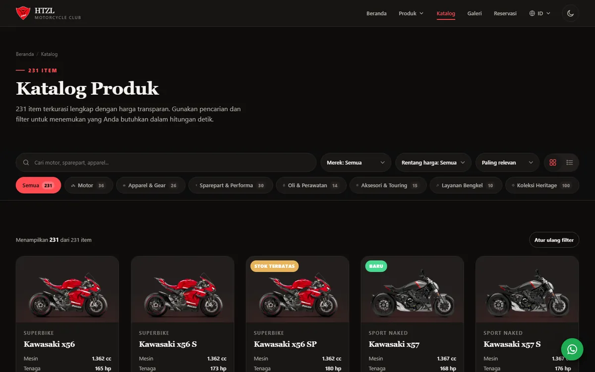

Pencarian menerima beberapa kata sekaligus dan mencocokkannya ke nama, merek,
jenis, kode produk, sampai ke isi tabel spesifikasi. Mengetik "Brembo",
"Cordura", atau "waterproof" langsung menyisakan produk yang memakainya.
Hasilnya muncul selagi mengetik.

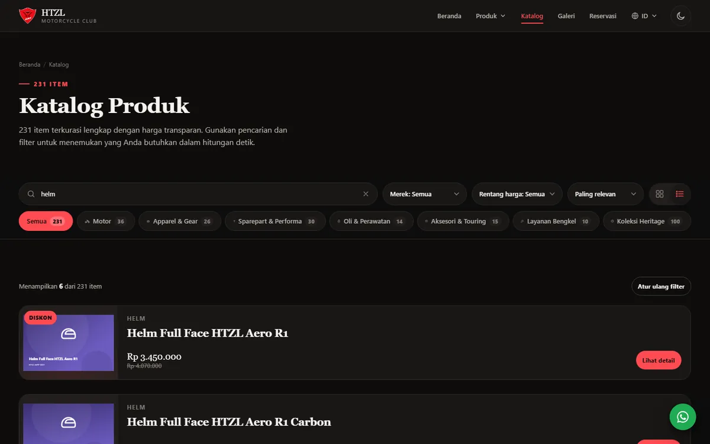

| Kontrol | Fungsinya bagi pengunjung |
|---|---|
| Pencarian | Ketik "helm carbon" atau "Brembo", langsung menyisakan produk yang dimaksud |
| Chip kategori | Tujuh kategori beserta jumlah isinya, sekali ketuk |
| Merek | Kawasaki, Vixian, Harley-Davidson, dan lini HTZL |
| Rentang harga | Enam tingkat, dari bawah Rp 500 rb sampai di atas Rp 500 jt |
| Urutan | Termurah, termahal, nama, atau rating |
| Kisi atau daftar | Kisi untuk melihat bentuk, daftar untuk membandingkan harga |

Setiap saringan tercatat di alamat halaman, jadi hasil pencarian bisa dikirim
apa adanya ke orang lain.

Tiap merek juga punya halamannya sendiri, dengan sampul dan penyaring trim
Standard, S, dan SP.

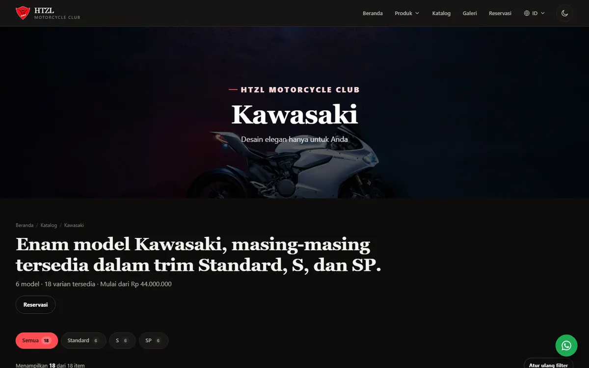

### Koleksi Heritage: 100 Harley-Davidson

Bagian yang membedakan HTZL dari dealer biasa: seratus unit dari 1903 sampai
2017, diurutkan dari yang tertua, dengan foto arsip dan spesifikasi lengkap.

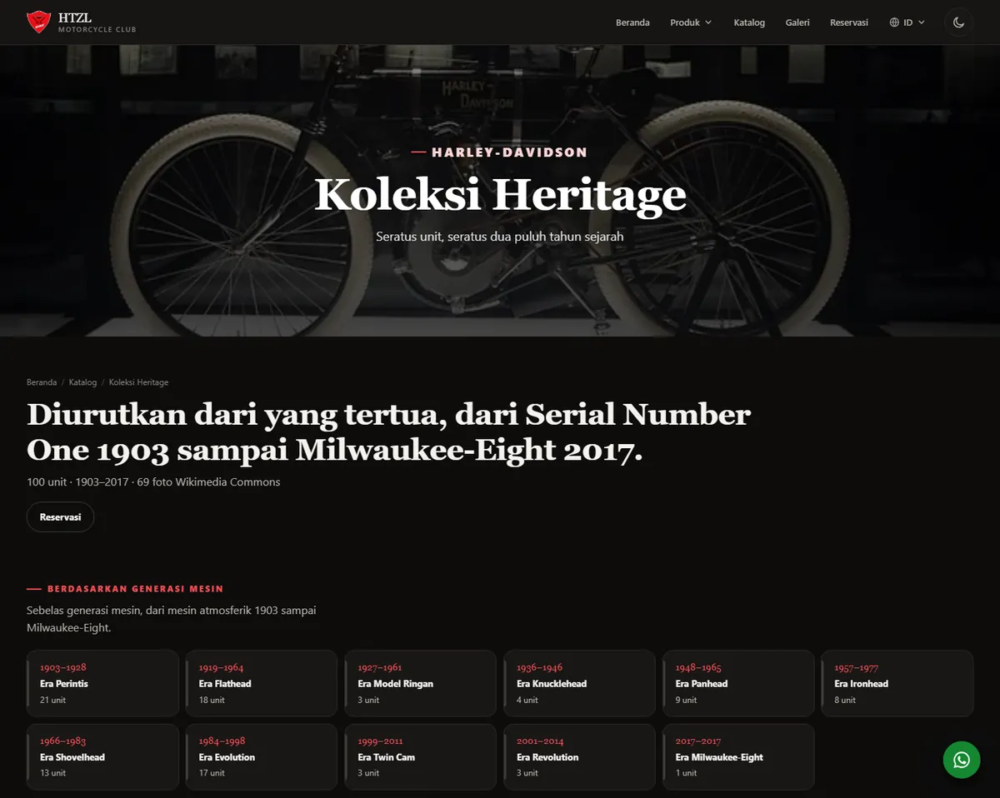

Di atas daftarnya ada garis waktu sebelas generasi mesin. Menekan satu generasi
langsung menyisakan unit dari era itu saja — cara menelusuri yang mengikuti
bagaimana penggemar motor berpikir, bukan sekadar daftar panjang.

| Generasi | Unit | Tahun |
|---|--:|---|
| Era Perintis | 21 | 1903–1928 |
| Era Flathead | 18 | 1919–1964 |
| Era Evolution | 17 | 1984–1998 |
| Era Shovelhead | 13 | 1966–1983 |
| Era Panhead | 9 | 1948–1965 |
| Era Ironhead | 8 | 1957–1977 |
| Era Knucklehead | 4 | 1936–1946 |
| Era Model Ringan | 3 | 1927–1961 |
| Era Twin Cam | 3 | 1999–2011 |
| Era Revolution | 3 | 2001–2014 |
| Era Milwaukee-Eight | 1 | 2017 |

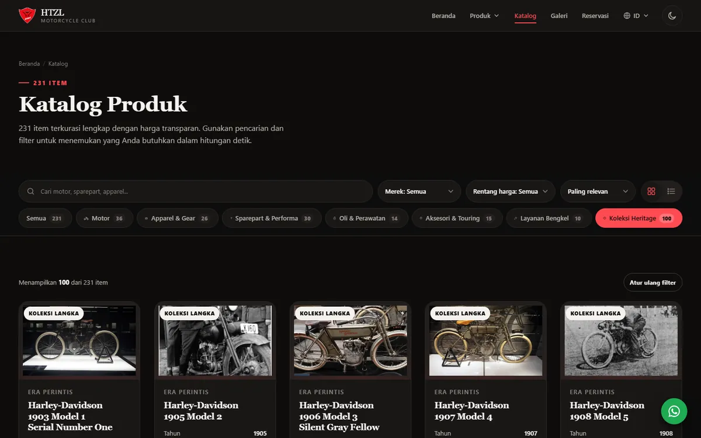

Enam puluh sembilan unit memakai foto arsip berlisensi bebas dari Wikimedia
Commons, lengkap dengan atribusi pembuat dan lisensinya. Sisanya memakai
artwork yang digambar khusus agar tampilan kartunya tetap satu bahasa visual.

### Detail produk dan pemesanan

Ketuk sebuah produk dan seluruh keputusan bisa diselesaikan di satu panel,
tanpa berpindah halaman.

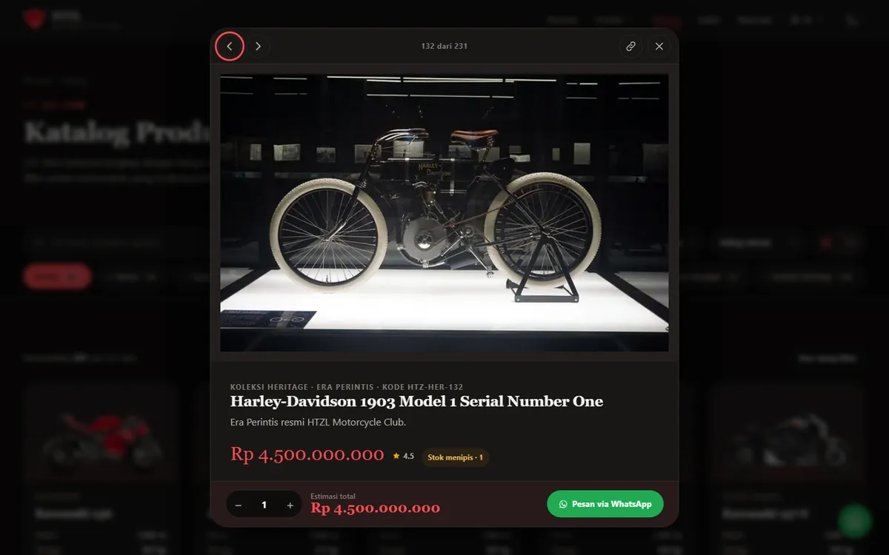

| Bagian | Fungsinya |
|---|---|
| Bar bawah menempel | Jumlah, total, dan tombol pesan selalu terlihat betapa pun panjang tabel spesifikasi |
| Pengatur jumlah | Total harga berubah seketika saat jumlah diubah |
| Panah kiri dan kanan | Bandingkan produk berurutan tanpa menutup panel, ada penunjuk posisi |
| Salin tautan | Menghasilkan alamat yang langsung membuka produk itu bagi penerimanya |
| Pesan WhatsApp | Sudah berisi nama, kode, jumlah, total, dan tautan produk |
| Atribusi foto | Tampil langsung di panel untuk foto arsip |

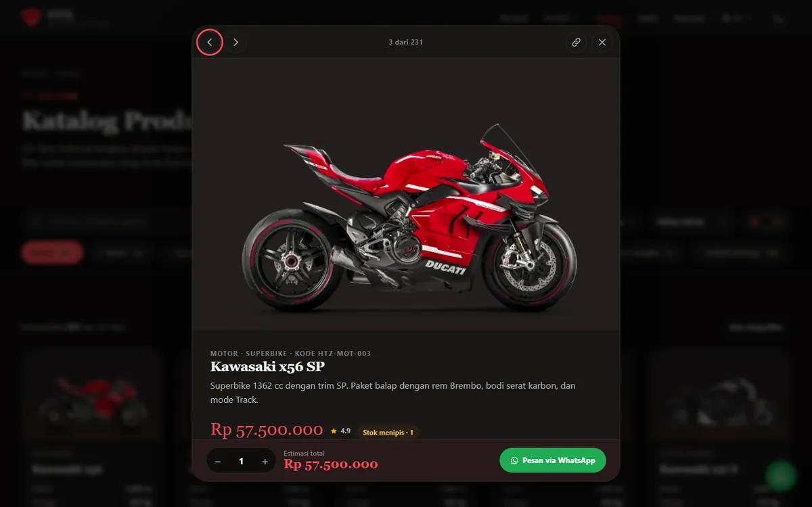

### Galeri

Delapan puluh satu foto: dokumentasi ruang pamer dan pameran, ditambah seluruh
foto koleksi heritage. Dibuka dalam tampilan penuh yang bisa dijelajahi dengan
tombol panah.

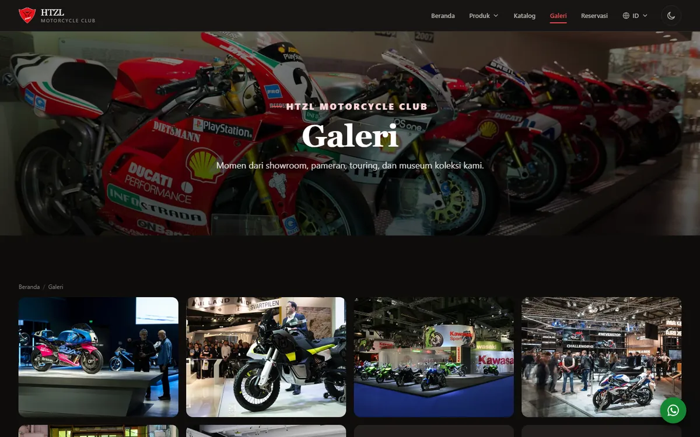

### Reservasi

Formulir yang memvalidasi selagi diisi, menghitung total pesanan langsung, lalu
menyusun pesan WhatsApp yang tinggal dikirim. Tidak ada data yang hilang di
tengah jalan.

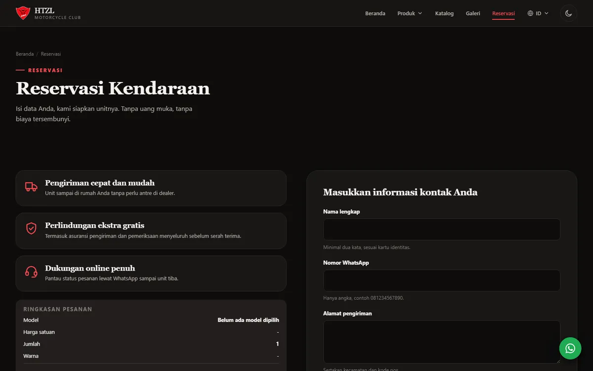

### Lima bahasa, satu pengalaman

Bukan sekadar teks antarmuka yang diganti. Nama kategori, jenis produk, nama
dan nilai spesifikasi, sampai penulisan tanggal semuanya mengikuti bahasanya.

| | Indonesia | English | 中文 | Русский | 日本語 |
|---|---|---|---|---|---|
| Mesin | 1.362 cc | 1,362 cc | 1,362 cc | 1362 cc | 1,362 cc |
| Tanggal | 29 Mei 2022 | 29 May 2022 | 2022年5月29日 | 29 мая 2022 | 2022年5月29日 |
| Jenis | Era Knucklehead | Knucklehead Era | Knucklehead 时代 | Эпоха Knucklehead | ナックルヘッド期 |

Perhatikan baris pertama. Bahasa Indonesia memakai titik sebagai pemisah
ribuan, sehingga `1.362 cc` akan terbaca "satu koma tiga" oleh pembaca
berbahasa Inggris. Angkanya pun ikut disesuaikan.

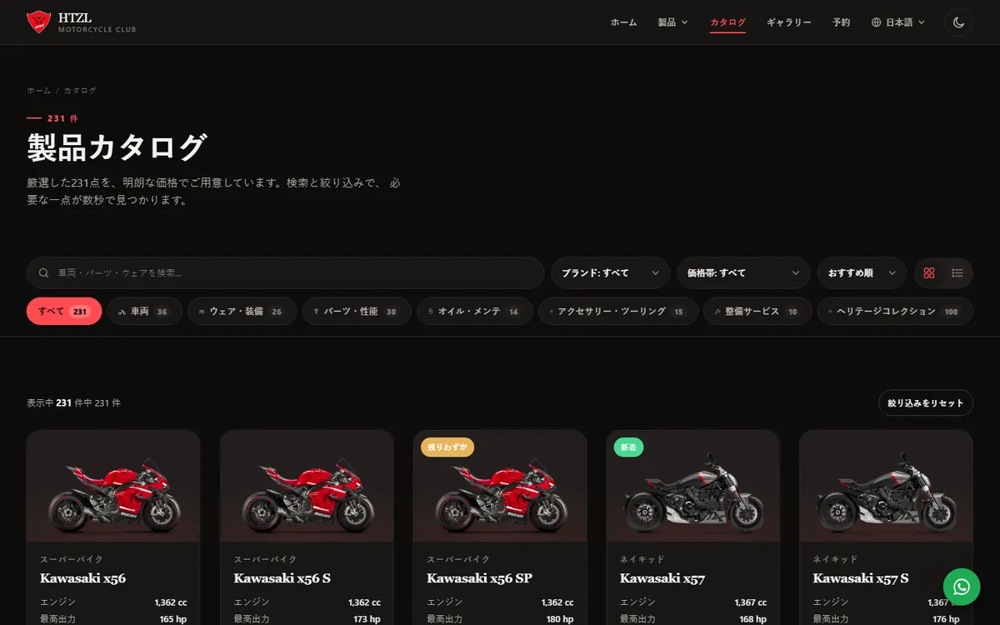

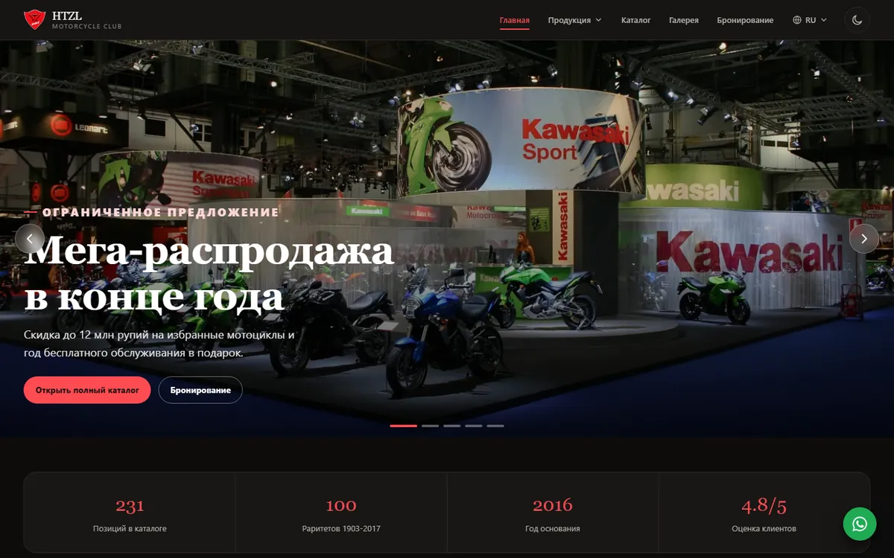

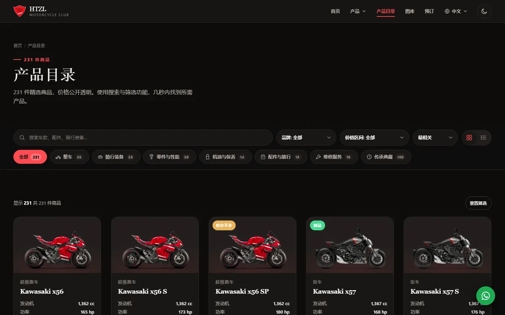

Tiap bahasa punya alamatnya sendiri, dan berpindah bahasa membawa serta saringan
yang sedang aktif — hasil pencarian tidak hilang saat ganti bahasa.

### Di ponsel

Dirancang pada lebar 390 piksel lebih dulu. Menu berupa panel geser, panel detail
naik dari bawah seperti aplikasi, dan halaman tidak pernah bisa digeser ke
samping.

<table>
<tr>
<td width="25%">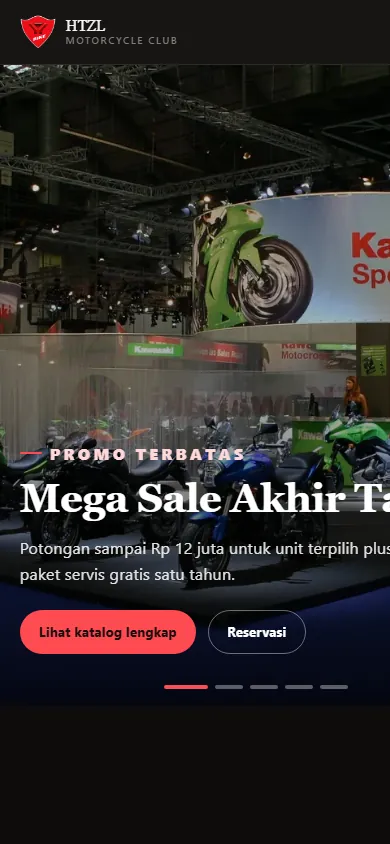</td>
<td width="25%">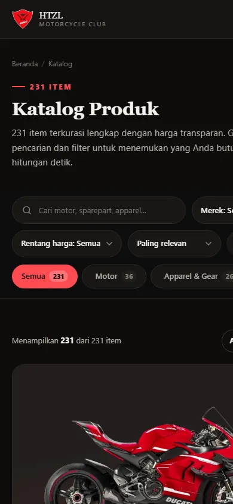</td>
<td width="25%">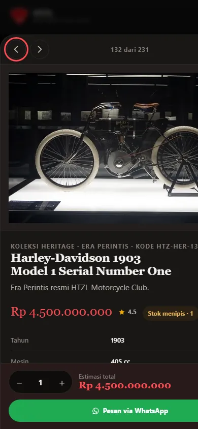</td>
<td width="25%">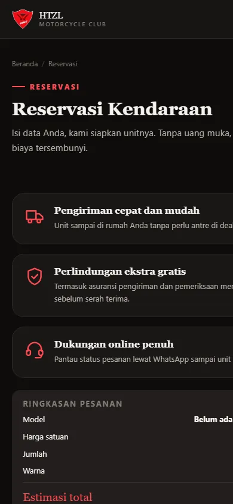</td>
</tr>
</table>

---

## Kualitas yang bisa diukur

Diukur pada lima halaman, termasuk katalog yang memuat seluruh 231 produk
sekaligus. Kondisinya sengaja tidak ramah: ponsel 390 piksel dengan kerapatan
layar 3x, CPU empat kali lebih lambat, jaringan Slow 4G, cache kosong seperti
kunjungan pertama. Yang ditampilkan adalah angka terburuk dari kelimanya,
diambil dari median tiga kali jalan.

| | Hasil terburuk | Ambang "baik" |
|---|--:|--:|
| Largest Contentful Paint | 1.980 ms | < 2.500 ms |
| Cumulative Layout Shift | 0,000 | < 0,1 |
| Total Blocking Time | 0 ms | < 200 ms |
| Halaman katalog terkompresi | 52 KB | — |
| Beranda terkompresi | 11 KB | — |
| Permintaan ke pihak ketiga | 0 | — |

**Gambar.** Tiap foto tersedia dalam beberapa ukuran, dan peramban mengambil
yang paling pas untuk lebar tampil serta kerapatan layarnya. Layar biasa
menarik 1,5 MB alih-alih 6,5 MB bila seluruh kartu berfoto dimuat, sementara
layar retina tetap menerima berkas penuh. Lebar dan tinggi setiap gambar dibaca
langsung dari berkasnya saat pembangunan, sehingga tata letak tidak pernah
melompat saat gambar selesai dimuat.

Gambar terbesar di layar pertama juga didahulukan: banner halaman dipasang
sebagai gambar biasa agar ditemukan peramban sejak awal, dan kartu pertama
katalog dimuat segera karena di sanalah elemen terbesar berada. Penyetelan ini
memangkas 92 sampai 264 milidetik pada keempat halaman utama tanpa menambah
satu byte pun.

**Aksesibilitas.** Diaudit dengan axe-core pada aturan WCAG 2.1 A/AA ditambah
best practice: **nol pelanggaran** di seluruh halaman. Navigasi keyboard penuh,
target sentuh minimal 44 piksel, kontras terjaga di kedua tema, dan animasi
dimatikan bila sistem meminta gerak minimal.

**Pengujian.** 182 test Ruby dan 23 test JavaScript berjalan pada tiap
perubahan, ditambah pemeriksaan gaya kode. Penerbitan dibatalkan bila ada yang
gagal.

---

## Di balik layar

Situs statis: tidak ada server, tidak ada basis data, tidak ada framework di
sisi pengunjung.

Seluruh katalog dibangun program dari sumber Ruby, lalu dirender jadi HTML
sebelum diterbitkan. Hasilnya menguntungkan dua pihak sekaligus: pengunjung
mendapat halaman yang langsung tampil, dan mesin pencari membaca seluruh 231
produk tanpa perlu menjalankan JavaScript.

| Bagian | Isi |
|---|---|
| Sumber data | Satu berkas Ruby; menambah produk cukup menyunting satu baris |
| Halaman | 36 halaman dibuat generator, tujuh halaman dikalikan lima bahasa |
| JavaScript | 16 KB, ditulis tangan, hanya untuk saringan dan panel detail |
| CSS | Satu berkas, tanpa framework |
| Penerbitan | GitHub Actions: bangun, uji, periksa gaya, terbitkan |

---

## Menjalankan sendiri

Prasyarat: Ruby 3.1 atau lebih baru.

```bash
git clone https://github.com/xyb3rpunq/htzl-motorcycle-club.git
cd htzl-motorcycle-club
bundle install
bundle exec rake serve
```

Situs terbuka di <http://localhost:4000/htzl-motorcycle-club/>.

```bash
bundle exec rake seed    # bangun ulang katalog dari sumber Ruby
bundle exec rake art     # buat artwork produk
bundle exec rake photos  # ambil foto arsip berlisensi bebas
bundle exec rake test    # test Ruby dan JavaScript
bundle exec rake lint    # periksa gaya kode
bundle exec rake ci      # semuanya, seperti di GitHub Actions
```

---

## Lisensi

Kode berlisensi [MIT](LICENSE). Font Arvo berlisensi SIL Open Font License 1.1.
Foto koleksi heritage berlisensi domain publik atau Creative Commons dengan
atribusi lengkap; rinciannya ada di [NOTICE.md](NOTICE.md).

> **HTZL Motorcycle Club adalah merek fiktif.** Situs ini karya portofolio.
> Tidak ada afiliasi dengan produsen sepeda motor mana pun, dan seluruh harga,
> spesifikasi, serta stok adalah data contoh.

<div align="center">
<br>
Dirancang dan dibangun oleh <a href="https://github.com/xyb3rpunq">Daniel Hutajulu</a>
<br><br>
<a href="https://www.instagram.com/danielxyz_/">Instagram</a> ·
<a href="https://x.com/xyb3rpunk">X</a> ·
<a href="https://www.linkedin.com/in/daniel-hutajulu23/">LinkedIn</a>
</div>
